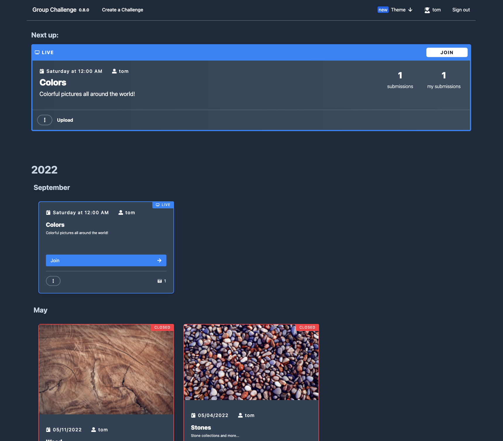

# Group Challenge

[](https://github.com/subshell/group-challenge/actions/workflows/docker-publish.yml)

An easy-to-use website to create submission-based challenges that will be evaluated together in real-time.
Any user is allowed to create challenges with a fixed start and end date while others join and contribute.
Currently supported challenges are:

- 📸 **Photo Challenge**



## Configuration

The configuration is usally located under `/app/config.yaml`.
We also support configuration via environment variabels with a `GC_` prefix:

- `GC_SERVER_PORT`
- `GC_DB_USER`
- `GC_DB_PASSWORD`

**All available configuration options:**

```yaml
server:
  port: 8080
  staticFilesDir: "./static"
db:
  user: postgres
  password: postgres # prefered method: use env variable GC_DB_PASSWORD
  database: group_challenge
  host: "localhost:5432"
  poolSize: 50
  logQueries: false
challenges:
  liveParty:
    defaultTimePerSubmissionSeconds: 45
imgProxy:
  enabled: true
  url: "http://localhost:8081"
  localFilePath: "/tmp/group-challenge-cache"
  thumbnailQuality: 90
  maxThumbnailWidth: 420
  maxThumbnailHeight: 420
  fullSizeQuality: 75
  maxFullWidth: 1280
  maxFullHeight: 1280
```

## Local development

This project includes pre-configured configuration files to launch the api, frontend, and postgres in VS Code.
Alternatively you can start all services with the following commands:

1. **Postgres:** start a postgres db at port `5432`.

```sh
  mkdir /tmp/group-challenge-cache
  docker-compose up
```

2. **API:** start the go api server at port `8080`.

```sh
  cd api && go run ./cmd/group-challenge/root.go
```

3. **Frontend:** start the frontend at port `3000`.

```sh
  cd frontend && npm run dev
```

## Container

For official container images visit https://github.com/subshell/group-challenge/pkgs/container/group-challenge

### Building the container

The container contains the frontend as well as the backend.

```sh
  docker build . --tag group-challenge
```

### Running the container

Before you can run the `group-challenge` container, make sure that postgresql and optionally imgProxy is running.
You can start both applications with `mkdir /tmp/group-challenge-cache && docker-compose up`.

By default you can open your browser at http://localhost:8080/ to see the running group-challenge app.

#### Your localy created container

```sh
  docker run --network=host group-challenge
```

#### Official container

```sh
  docker run --network=host ghcr.io/subshell/group-challenge:latest
```

## Kubernetes support

The helm chart is available under https://subshell.github.io/helm-charts-lab/

```sh
helm repo add subshell-public https://subshell.github.io/helm-charts-lab
helm install -f gc-values.yaml group-challenge subshell-public/group-challenge
```

This chart uses the [Bitnami Postgres Helm Chart](https://github.com/bitnami/charts/tree/master/bitnami/postgresql) as a dependency. Configure it with `postgresql` in your `values.yaml` file.
You definitely want to change the password using `global.postgresql.postgresqlPassword` or a secret. You have to install the `pgcrypto` extension manually.

2. Open the browser at `http://localhost:8080`.

## Image processing

To reduce the size of all uploaded images, we support [imgProxy](https://docs.imgproxy.net). See `imgProxy` for its configuration.

---

Take a look at this project from the [subshell](https://subshell.com) team. We make [Sophora](https://subshell.com/sophora/): a content management software for content creation, curation, and distribution. [Join our team!](https://subshell.com/jobs/) | [Imprint](https://subshell.com/about/imprint/)
